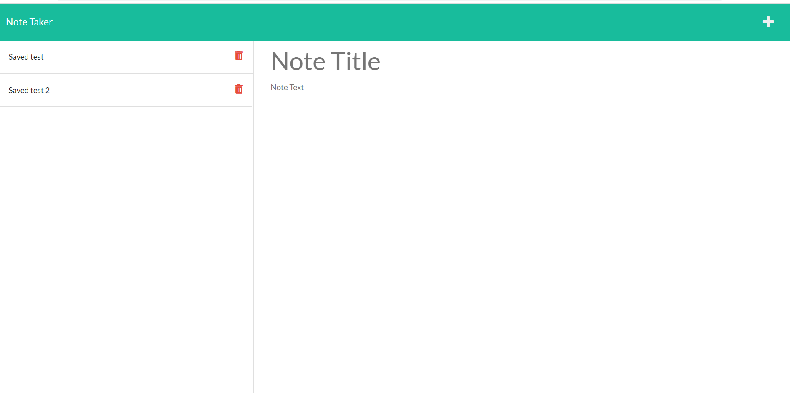

# note-keeper
# Authors

Allen Klein

- [Link to Heroku Site](https://gentle-river-68136.herokuapp.com/)
- [Link to Github Repository](https://github.com/allen-ek/note-keeper)

## Why?
I wanted to create a website that would allow for access to write down and see notes from anywhere with internet connection. Using Heroku to
host the site. As well as improve my understanding of web hosting development.

## What I learned
I learned how to use Node.js, Express npm to serve client side data as well as how to incorparate a server to fetch and host the data for 
the note keeper application. I also learned how to create html and api paths to handle requests and how to respond to these requests.
## Technologies Used
Bootstrap
Express
Node.js
CSS
HTML
Heroku
Github

## Code Snippet
```html
app.post("/api/notes/", function(req,res) {
  //logic to post a note
  const { title,text } = req.body;
  if (title && text) {
    // Variable for the object we will save
    const newNote = {
      title,
      text,
      id: uuidv4(), 
    };
    //const noteString=JSON.stringify(newNote);
    fs.readFile('./db/db.json', 'utf8', (err, data) => {
      if (err) {
        console.error(err);
      } else {
        var noteString=JSON.parse(data);
        noteString.push(newNote);
        noteDB = noteString;
        fs.writeFile(
          './db/db.json',
          JSON.stringify(noteString),
          (err) =>
            err
              ? console.error(err)
              : console.info('Added notes')
        );
      }
    });
     res.json(newNote)
    }
```
The code snippet above was the code in order to handle a post request using the /api/notes/ path that would allow for the sender to input there
note title and note text then respond with the created note to the page.

